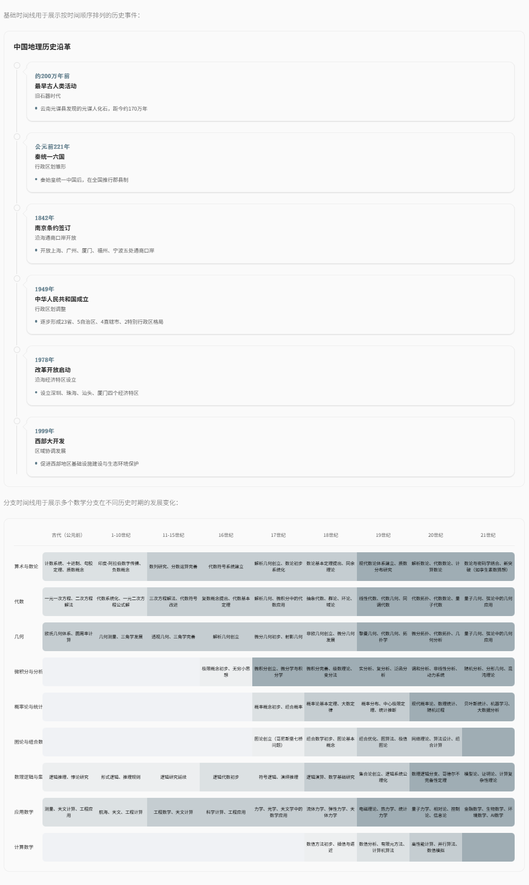

# SiteHangar

SiteHangar 是一个数据驱动可以支持多知识类网站的框架。该项目设计的核心思想就是将数据与展示分离，用户只需要关注文章层级放分类和内容，不需要在系统上进行复杂的配置操作，编辑工具与文章数据格式不需要和这个项目强耦合。

项目自定义了基于文件系统的文章组织方式和一种扩展的 Markdown 语法EXTD（`extended Markdown`），通过文件夹层次结构划分文章所属的网站、栏目、分类，通过手工编辑或者AI生成extd格式的文章内容，除了支持常见的列表、表格外还支持两种时间线、多种数据图表、多种富文本卡片。编译工具扫描文件夹结构建立索引的同时将文章内容合并转换成json格式提供给后端服务使用，用户无需进行复杂的配置工作也不需要关心页面设计， 只用**维护好目录结构和文章内容**。

在功能重点关注网站的展示功能，尽量提供简约干净的外观和丰富的数据展示方式，不提供用户登录、评论、后台管理等交互功能。

该项目使用 Vue 3 + Vite + TypeScript + Pinia + Vue Router + Tailwind CSS + ECharts 技术栈。

AI 编程前请优先阅读 [docs/readme-for-ai.md](docs/readme-for-ai.md)。

## 背景

一开始只是想自己做个只是类的网站，过程中尝试过多种方案，最终演化出该项目：

| 方案 | 问题 |
| --- | ----|
| AI 生成一批静态 HTML 页面 | 样式五花八门，不统一 |
| 静态 HTML + 共享 CSS/JS | 样式看起来一致，但是生成的时候AI并不100%的按照要求生成，少部分仍然会不一致，生成过程卡住后需要从头来，耗时较长 |
| 数据和展示分离，模板页 + JSON 数据，也是纯静态网站 | 样式和操作功能保证完全一致，但是json有3个问题：1格式复杂体积大生成耗时耗token 2人工难编辑 3 AI生成格式不能保证正确，修复成本高 |
| 决定造一个网站加载器，也就是这个项目，先在成熟的 Markdown 基础上定义extd方便编辑也短小且git优化，一篇文章可以多文档方便AI生成提速降低每次修改的token消耗，通过目录结构不是复杂的配置文件或者数据控制文章的分类简化使用，配合 Vue/Node 规范化开发 | <br />                               |

## 产品特点

- **面向知识类网站**：适合构建 Wiki、知识库、专题资讯站等以阅读为主的站点，不支持点赞评论等互动，也没有用户管理体系。
- **展示和数据分离**：内容编写与系统运行解耦，网站数据可独立维护，甚至由不同团队负责
- **多站点共享**：一套代码可服务多个域名，每个站点拥有独立的栏目和内容。
- **文件系统组织数据**：不使用数据库，所有的网站数据都基于文件系统的目录结构组织数据，天然支持 Git 版本控制，方便人工和 AI 维护。
- **EXMD 内容格式**：扩展 Markdown，支持图表、时间线、统计卡片、分栏布局等可视化控件，用户只用关心内容无需操心页面设计。


## 数据组织方式

### 目录结构

网站数据按“站点 → 栏目 → 一级分类 → 二级分类 → 文章”五层组织：

```
data/
├── <site-domain-1>/            # 站点目录 1，如 www.a.com
│   ├── meta.yaml               # 站点元数据：网站附加信息，比如栏目介绍和栏目封面图
│   ├── image/                  # 站点级封面图（模块封面等）
│   ├── info/                   # 站点信息页（关于、帮助等）
│   │   └── image/              # info 页内引用的图片（可选）
│   └── <module>/               # 栏目目录，id 与 meta.yaml 中 module.id 对应
│       └── <一级分类>/          # 分类目录，名称按字典序排列，可带序号前缀
│           └── <二级分类>/
│               └── <article-slug>/   # 文章目录，内部结构见「两种文档模式」
└── <site-domain-2>/            # 站点目录 2，如 www.b.com
    ├── meta.yaml
    ├── image/
    ├── info/
    │   └── image/
    └── <module>/
        └── <一级分类>/
            └── <二级分类>/
                └── <article-slug>/
```


### 内容格式：EXMD

EXMD（Extended Markdown）是 SiteHangar 的文章源格式，完全兼容标准 Markdown，并扩展了知识类内容所需的控件和布局能力。

**主要特点**：

- 支持统计卡片、卡片列表、时间线、分支图、标签芯片、树状图、图表（柱状图/饼图/折线图）、分栏布局。
- 一篇文章对应一个文件夹，包含 Markdown 源文件、图片和引用的数据文件。
- 图表数据可内嵌或引用外部 JSON 文件，便于维护和复用。

**两种文章模式**：

| 模式  | 特点            | 适用场景    | 优点                  |
| --- | ------------- | ------- | :------------------ |
| 单文件 | `一个md文件和附件`   | 简短笔记、备忘 | 人工快速编辑              |
| 多文件 | 每个章节一个md文件和附件 | 长文      | AI并行生成，局部修改快速省token |

文章内容本身也分三层：文章 → 章节 → 段落。段落支持文本、图片、图表、表格、时间线、分栏等元素。

+ 总体分文章，章节，段落三个层级。
+ 一个文章可以包含多个章节，每个章节可以包含多个段落，每个段落可以包含文本、图片、图表、表格等元素。
+ 文章有包含文章标题、文章副标题、文章引言、文章标签等属性。章节包含章节标题、章节副标题等属性。段落包含文本、图片、图表、表格等属性。

```
Article（文章）
  ├── Article Title（文章标题）← 来自 frontmatter，忽略正文 #
  ├── Article Subtitle（文章副标题）
  ├── Article Introduction（文章引言）
  ├── Article Tags（文章标签）
  └── Chapters（多个章节）
        ├── Chapter 01
        │     ├── Chapter Title（章节标题）← 来自章节 frontmatter，忽略正文 ##
        │     ├── Chapter Subtitle（章节副标题）
        │     └── Paragraphs（多个段落）
        │           ├── Text / Images / Charts / Tables
        │           ├── Sub-headings（###）
        │           ├── Sub-sub-headings（####）
        │           └── Columns（可选分栏）
        ├── Chapter 02
        └── ...
```

目前支持的扩展类型有：

| 扩展类型 | 说明              | 引用数据                                                 | 内嵌数据                      |
| ---- | --------------- | ---------------------------------------------------- | ------------------------- |
| 统计卡片 | 展示关键数值          | ``                            | code 块 `stats`            |
| 卡片列表 | 多卡片并列展示         | ``                            | code 块 `cards`            |
| 时间线  | 时间序列事件          | ``                         | code 块 `timeline`         |
| 分支图  | 多阶段分支对比         | ``                         | code 块 `branches`         |
| 标签芯片 | 标签云/关键词         | ``                            | code 块 `chips`            |
| 树状图  | 层级结构展示          | ``                             | code 块 `tree`             |
| 图标列表 | 列表项含图标/标题/副标题   | 含 `\|` 分隔符的 Markdown 列表                              | code 块 `list`             |
| 图表   | 支持 bar/pie/line | ``、``、`` | code 块 `bar`/`pie`/`line` |

示例：




除此之外还支持分栏布局。


## 技术架构

| 层  | 技术                                                                      |
| -- | ----------------------------------------------------------------------- |
| 前端 | Vue 3 + Vite + TypeScript + Pinia + Vue Router + Tailwind CSS + ECharts |
| 后端 | Node.js + Express + TypeScript                                          |
| 数据 | Markdown + YAML，编译后生成 JSON 文件                                           |

**渲染流程**：用户请求 → Nginx → 前端页面 → Vue Router → 调用 `/api/render/*` → Express 读取 JSON 数据 → 动态渲染页面。

## 项目文档

| 文档                                                 | 说明                       |
| -------------------------------------------------- | ------------------------ |
| [docs/01.requirement.md](docs/01.requirement.md)   | 需求：概述、特性、功能需求、非功能需求      |
| [docs/02.architecture.md](docs/02.architecture.md) | 架构设计：技术栈、代码模块、数据流、API 流程 |
| [docs/03.deployment.md](docs/03.deployment.md)     | 部署运维：线下测试、线上部署、容器管理      |
| [docs/04.data-format.md](docs/04.data-format.md)   | 数据格式：文件夹结构、EXMD 语法、编译结果  |
| [docs/05.changelog.md](docs/05.changelog.md)       | 变更日志：项目演进记录              |
