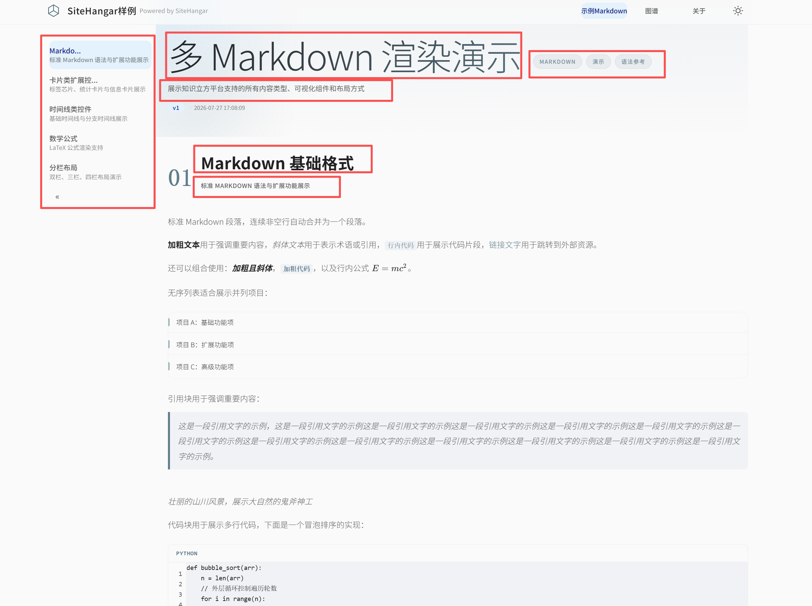
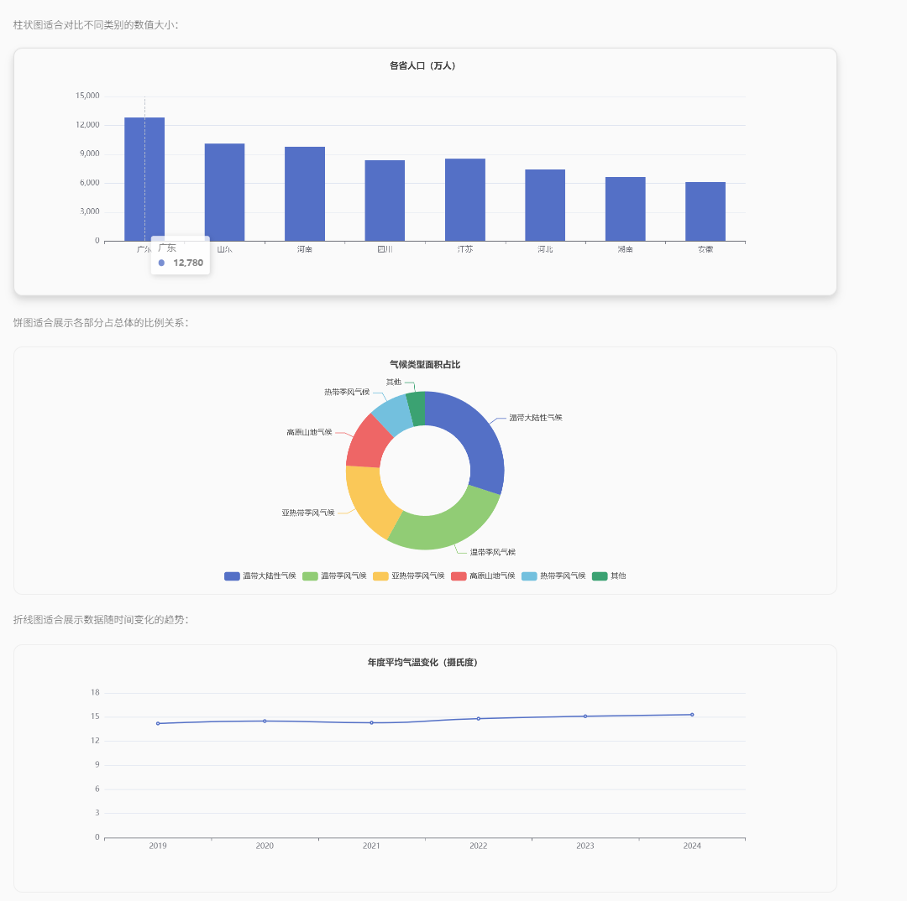

# 数据格式

## 概述

该项目通过分析数据文件夹的数据，自动识别出文章、章节、段落等元素，并根据元素的层级关系，生成对应的 JSON 数据。最终，这些 JSON 数据会被前端渲染，展示在用户界面中。

本文档主要介绍如下3个部分：

1. 文件夹结构，网站，栏目，分类等如何组织的
2. EXMD 格式说明，一篇文章如何渲染
3. 编译后的格式

使用文件系统作为存储设计原因和优势

- 不用特别的工具可以轻松查看内容进行修改
- 文件系统自带上下级树形结构，不需要复杂的数据库可以和配置，文章规模，分类，上下级关系清晰，无需额外工具查看和修改
- 版本控制友好，网站数据可以git管控，diff和提交记录清晰可见
- 方便AI阅读修改，命令行工具完成全部工作

**可以参考 example\data 下的示例数据对照**

**AI 生成内容时，请优先阅读 [exmd-for-ai.md](exmd-for-ai.md)。**

## 文件夹结构

该项目支持多网站加载，内容按「站点」组织，数据根目录下每个子文件夹对应一个站点，文件夹名即站点域名。

```
data/
├── <site-domain-1>/            # 站点目录 1，如 www.a.com
│   ├── meta.yaml               # 站点元数据：网站附加信息，比如栏目介绍和栏目封面图
│   ├── image/                  # 站点级封面图（模块封面等）
│   ├── info/                   # 站点信息页（关于、帮助等）
│   │   └── image/              # info 页内引用的图片（可选）
│   └── <module>/               # 栏目目录，id 与 meta.yaml 中 module.id 对应
│       └── <一级分类>/          # 分类目录，名称按字典序排列，可带序号前缀
│           └── <二级分类>/
│               └── <article-slug>/   # 文章目录，内部结构见「两种文档模式」
└── <site-domain-2>/            # 站点目录 2，如 www.b.com
    ├── meta.yaml
    ├── image/
    ├── info/
    │   └── image/
    └── <module>/
        └── <一级分类>/
            └── <二级分类>/
                └── <article-slug>/
```

**要点**：

- `meta.yaml` 定义站点首页信息（`page`）和栏目列表（`modules`），`modules[].id` 必须与栏目目录名一致，`modules[].image` 只写文件名，构建时自动转为 `/api/image/<site>/<filename>`。

**`meta.yaml`** **示例**（以 `science.example.local` 为例）：

```yaml
page:
  title: "理科知识"
  description: "数学、物理、化学、生物等理科知识的系统学习"
  brand_name: "SCIENCE_KNOWLEDGE"
  subtitle: "探索科学奥秘，从基础原理到前沿发现"
  tags:
    - "科学普及"
    - "知识系统"
    - "学习平台"

modules:
  - id: "math"
    title: "数学"
    description: "从几何到代数，探索数学的逻辑之美"
    image: "math.jpg"
    tags:
      - "逻辑"
      - "计算"
      - "抽象"
  - id: "physics"
    title: "物理"
    description: "从光学到力学，理解自然界的运行规律"
    image: "physics.jpg"
    tags:
      - "实验"
      - "规律"
      - "宇宙"
```

- 分类目录层级数量不限，名称前的序号（如 `01 技术类`）用于控制排序，展示时会去掉序号。

**示例**：

```
data/
├── science.example.local/              # 站点一：理科知识
│   ├── meta.yaml                       # modules: math、physics
│   ├── image/
│   │   ├── math.jpg
│   │   └── physics.jpg
│   ├── info/
│   │   ├── meta.md
│   │   └── 01-overview.md
│   ├── math/                           # 栏目：数学
│   │   └── 01 代数/
│   │       └── 古代/
│   │           └── development-history/
│   └── physics/                        # 栏目：物理
│       └── 01 力学/
│           └── 古代/
│               └── key-figures/
└── travel.test.local/                  # 站点二：旅行资讯
    ├── meta.yaml                       # modules: nature、culture、leisure
    ├── image/
    │   ├── nature.jpg
    │   ├── culture.jpg
    │   └── leisure.jpg
    ├── info/
    │   ├── meta.md
    │   └── 01-overview.md
    ├── nature/                         # 栏目：自然景观
    │   ├── 01 华东/
    │   │   └── 01 浙江省/
    │   │       └── hangzhou-westlake/
    │   └── 02 华北/
    │       └── 01 安徽省/
    │           └── huangshan/
    └── culture/                        # 栏目：人文景观
        └── 04 西北/
            └── 01 青海省/
                └── dunhuang-mogao/
```

## EXMD（Extended Markdown）

EXMD（Extended Markdown）是 SiteHangar 针对单篇文章原始数据格式，在Markdown格式基础上做了扩展，基于markdown格式是方便人和AI阅读，扩展是知识类内容展示的更加丰富。

特点：

- 支持诸如柱状图，条形图，时间线等可视化控件。支持分栏布局。
- 与传统Markdown不同的是，以往一个markdown文件就是一个文章，exmd格式下，一篇文章对应一个文件夹。这个文件夹包含所文章所有的内容，包括图片和数据。
- 为了方便AI自动生成和人工编辑，支持当md格式和多md格式两种模式。

Markdown 基础语法完全兼容，这里不做复述只介绍扩展语法

**具体示例可以参考：example\\data\\data.format.show\\exmd\\演示\\**

### 内容层级

在介绍具体语法之前，先介绍下内容的逻辑元素。

+ 总体分文章，章节，段落三个层级。
+ 一个文章可以包含多个章节，每个章节可以包含多个段落，每个段落可以包含文本、图片、图表、表格等元素。
+ 文章有包含文章标题、文章副标题、文章引言、文章标签等属性。章节包含章节标题、章节副标题等属性。段落包含文本、图片、图表、表格等属性。

```
Article（文章）
  ├── Article Title（文章标题）← 来自 frontmatter，忽略正文 #
  ├── Article Subtitle（文章副标题）
  ├── Article Introduction（文章引言）
  ├── Article Tags（文章标签）
  └── Chapters（多个章节）
        ├── Chapter 01
        │     ├── Chapter Title（章节标题）← 来自章节 frontmatter，忽略正文 ##
        │     ├── Chapter Subtitle（章节副标题）
        │     └── Paragraphs（多个段落）
        │           ├── Text / Images / Charts / Tables
        │           ├── Sub-headings（###）
        │           ├── Sub-sub-headings（####）
        │           └── Columns（可选分栏）
        ├── Chapter 02
        └── ...
```

各种元素的展示如下



### 文件结构

为了方便AI自动生成和人工编辑，支持当md格式和多md格式两种模式。

- 单md格式：主要方便人工编辑小的文章
  - 只有page.md文件记录文章的所有内容，包括文章标题、文章副标题、文章引言、文章标签等属性。
- 多md格式：主要用于大规模文章
  - meta.md文件记录文章的元数据，包括文章标题、文章副标题、文章引言、文章标签等属性。
  - 每个章节对应一个markdown文件，文件名就是章节的标题。文件名称有数字前缀，数字是章节的顺序。
  - 方便AI自动生成，多个章节可以并行生成。修改章节内容时，只需要修改对应的markdown文件即可。减少上传和生成的token成本和耗时。

编译工具按以下顺序检测：

1. 如果存在 `meta.md` + `01-xxx.md` 章节文件 → **多 Markdown 模式**
2. 如果存在 `page.md` → **单 Markdown 模式**
3. 无 Markdown 文件 → 不需要编译

结构如下

单文件格式

```
single-md-example/
├── page.md                 # 文章元数据 + 全部正文
├── image/                  # 页面级图片
│   ├── b.jpg
│   └── a.jpg
└── data/                  # 页面级数据
    ├── yyy.json
    └── xxx.json
```

多文件格式

```
multi-md-example/
├── meta.md                 # 文章元数据
├── 01-markdown-basics.md   # 第一章：基础 Markdown
├── 02-card-controls.md     # 第二章：卡片控件
├── 03-timeline-controls.md # 第三章：时间线控件
├── image/                  # 页面级图片
│   ├── b.jpg
│   └── a.jpg
└── data/                  # 页面级数据
    ├── yyy.json
    └── xxx.json
```

### 基础语法

markdown 支持的列表，表格，加粗等基础语法和普通markdown 工具一致，标题有些特殊规则，如下：

| 标题         | 作用      | 单 MD 文件                                                       | 多 MD 文件                                                  | 渲染                    |
| ---------- | ------- | ------------------------------------------------------------- | -------------------------------------------------------- | --------------------- |
| H1（`#`）    | 文章标题    | 正文中被忽略，页面标题只用 frontmatter `title`                             | 正文中被忽略，页面标题只用 `meta.md` frontmatter `title`              | 网页 title（页签），hero大标题  |
| H2（`##`）   | 章节标题    | 作为 **section 拆分标记**，每个 `##` 生成一个章节，标题取自 `##` 文本，单md模式不支持章节副标题 | 正文中被忽略，章节标题取自章节文件 frontmatter 的 `title`，副标题取自 `subtitle` | `<h2>`section 标题      |
| H3（`###`）  | 正文子标题   | 作为正文子标题                                                       | 作为正文子标题                                                  | `<h3> 文子标题`           |
| H4（`####`） | 正文二级子标题 | 作为正文二级子标题                                                     | 作为正文二级子标题                                                | `<h4> 二级子标题`          |
| 五级以上       | 不支持     | 不支持                                                           | 不支持                                                      | 不支持                   |

**核心规则**：

- 一级标题是文章标题，二级标题是章节标题，三级和四级标题是正文可以使用的标题，五级及更高级别的标题不支持。
- 单 MD 模式下，`##` 用于把正文拆分为多个 section，标题取自 `##` 文本。
- 多 MD 模式下，章节已经由文件拆分，正文中的 `##` 被忽略，章节标题和副标题只来自章节文件 frontmatter 的 `title` 和 `subtitle`。
- 正文中的 `###` 统一渲染为 `<h3>`，`####` 统一渲染为 `<h4>`。

渲染示例如下


### 扩展功能

EXMD 在标准 Markdown 基础上扩展了可视化控件、分栏等语法。

#### 扩展控件

扩展又内嵌数据和引用数据两种方式，内嵌数据参考原始markdown中的code语法，引用数据参考markdown格式中的img语法

**引用数据**

针对数据量较大的情况，引用外部 JSON 文件，例如：

```

```

**内嵌数据**

针对数据量较小的情况，直接在 Markdown 中嵌入 JSON，例如：

```
chips
[
  { "label": "Markdown", "accent": false },
  { "label": "语法演示", "accent": false },
  { "label": "SiteHangar", "accent": true },
  { "label": "知识管理", "accent": false }
]
```

目前支持的扩展类型有：

| 扩展类型 | 说明              | 引用数据                                                 | 内嵌数据                      |
| ---- | --------------- | ---------------------------------------------------- | ------------------------- |
| 统计卡片 | 展示关键数值          | ``                            | code 块 `stats`            |
| 卡片列表 | 多卡片并列展示         | ``                            | code 块 `cards`            |
| 时间线  | 时间序列事件          | ``                         | code 块 `timeline`         |
| 分支图  | 多阶段分支对比         | ``                         | code 块 `branches`         |
| 标签芯片 | 标签云/关键词         | ``                            | code 块 `chips`            |
| 树状图  | 层级结构展示          | ``                             | code 块 `tree`             |
| 图标列表 | 列表项含图标/标题/副标题   | 含 `\|` 分隔符的 Markdown 列表                              | code 块 `list`             |
| 图表   | 支持 bar/pie/line | ``、``、`` | code 块 `bar`/`pie`/`line` |
| 公式   | 展示数学公式          | - |$$\int\_{a}^{b} f(x) , dx = F(b) - F(a)$$|

展示示例如下





#### 分栏

分栏语法为 `===== ... ----- ... =====`，最多 4 栏，不可嵌套。

展示示例如下


## 编译结果

编译是将用户编辑的原始文件，转换成系统可以使用的文件类型。用户编辑md文件方便舒适，系统加载json文件速度快格式也更准确。编译主要任务是两个：

+ 复制文件夹结构，建立索引文件
+ 处理单篇文章

编译结果的格式以代码实现为准，详细数据结构参考代码实现。

### 编译文件夹结构

分成两步：
1. 建立文件夹结构，保持和原始文件夹结构一致
2. 构建索引文件index.json，包含所有文章的索引信息。

### 单篇文章编译

分成两步：
1. 处理文章内容，生成json文件，json包含md文件的全部信息，引用附件路径
2. 处理附件文件，复制到目标文件夹下

### 编译结果示例

以 `example/build/travel.test.local` 为例，编译后保持原始目录层级，每篇文章目录生成 `data.json`，站点根目录生成 `index.json`：

```
travel.test.local/
├── index.json                  # 站点索引（含 page/hero/modules/columns）
├── image/                      # 站点级图片
│   └── nature.jpg
├── info/
│   └── data.json               # 站点信息页
├── culture/                    # 栏目（与 meta.yaml 中 module.id 对应）
│   └── 01 华东/
│       └── 01 浙江省/
│           └── suzhou-gardens/ # 文章目录
│               ├── data.json   # 文章编译结果
│               ├── image/      # 页面级图片（可选）
│               └── data/       # 文章引用的数据文件
│                   ├── stats.json
│                   └── timeline.json
├── nature/
│   └── ...
└── leisure/
    └── ...
```

单篇文章编译结果 `data.json` 示例（已剪枝）：

```json
{
  "page": {
    "title": "苏州古典园林",
    "description": "苏州园林是中国古典园林的代表..."
  },
  "hero": {
    "title": "苏州古典园林",
    "tags": ["世界遗产", "园林", "苏州"]
  },
  "introduction": "苏州园林是中国古典园林的代表...",
  "sections": [
    {
      "id": "简介",
      "title": "简介",
      "subtitle": "",
      "type": "mixed",
      "content": {
        "description": ["苏州古典园林始于春秋..."],
        "blocks": [
          { "type": "description", "data": ["苏州古典园林始于春秋..."] },
          { "type": "columns", "data": [{"items": [...]}, {"items": [...]}] }
        ]
      }
    },
    {
      "id": "拙政园",
      "title": "拙政园",
      "subtitle": "留园",
      "type": "mixed",
      "content": {
        "blocks": [
          { "type": "columns", "data": [{"items": ["### 拙政园", ...]}, {"items": ["### 留园", ...]}] }
        ]
      }
    }
  ],
  "version": "v1",
  "lastModified": "2026-07-28 12:14:04"
}
```

### 其他注意事项

+ 多md模式和引用数据文件的设计都是为了方便AI自动生成，一方面支持并行，另一方面修改或者重新生成的时候可以尽复用已有数据，减少对token的消耗和耗时。实际中直接生成大规模的文章常常会造成上下文超长，对大文档修改几行字，大模型也要完整的吐出一整篇文章，浪费99%的token和时间。